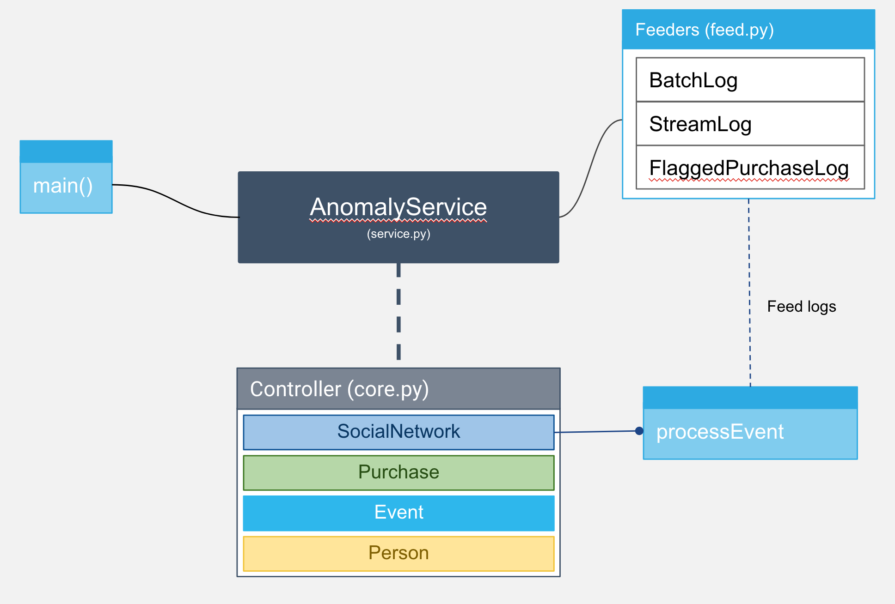

# Anomaly Detection

The problem can be abstracted to three parts:

`Service`: Main entry and initializer, connect `Feeder` with `Controller`

`Feeder`: IO component, provide JSON object to other components.

`Graph`: maintain the network, locate user group by their connections

`Controller`: A role who process our event data, check the threshold of `Flagged Purchase`

## Design

`Feeder`:

    JSONLog: Base class, implement an iterator for streaming the log

    FlaggedPurchasesLog: Write flagged purchases to json file

    StreamLog: feed logs with event data

    BatchLog: feed logs for building initial network
  
  
`Service`:

    AnomalyService: 
    
      This class should be run as a daemon or service.

      Now, for simplicity, there is no event loop inside.

      The service will be blocked on StreamLog.Stream() which is a JSON object generator
    
 `Graph` and `Controller`:
 
     SocialNetwork: 
        It is a graph(maintain person network connection) and a coordinator(process events )

     Person: maintain person id and his/her network

        Use adjacent list to storage relationship.

        For example: 

        A and B are friends, B and C are friends, the data structure should be like this:
        A -> [B]
        B -> [A, C]
        C -> [B]
        
     Event: Store event data, deserialize from JSON, serialize back to string
     
     Purchase: Some kind of memory DB
     
         use following data structure to storage purchase data
         list = [
           {'userid': 1, 'amount': 5.67, 'timestamp': 2017-11-01 13:12:00},
           {'userid': 1, 'amount': 5.67, 'timestamp': 2017-11-01 13:12:00},
         ]

         It has a strategy to only keep necessary data and get rid of outdated data.
         For example:
            When T=50, current people count is 10000, in worst case, there is no edges in the network,
            we need to keep 50 * 10000 records in order to calculate mean and sd

Basic Archtechture   

# Envrionment
Python 3

# Run 
`python3 detection_main.py --batch-log=batch_log.json --stream-log=stream_log.json --output=flagged_purchases.json`

## import models

`from src.service import AnomalyService`

`from src.feed import StreamLog, BatchLog, FlaggedPurchasesLog`

`from src.core import SocialNetwork, Person, Event, Purchase`
